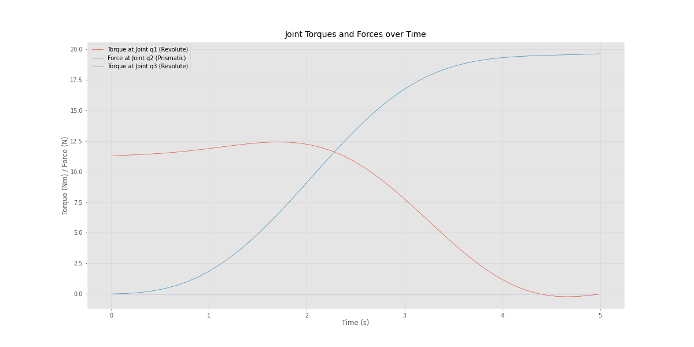

# RPR Robotic Dynamics Simulation

This repository contains the dynamics simulation of an RPR (Revolute-Prismatic-Revolute) manipulator. The links are modeled as cylinders with a radius of 10 cm. The lengths of the links are:
- **L1** = 0.4 m
- **q2** (prismatic joint) and **L3** = 0.1 m.

All links are of unit mass (1 kg), and the center of mass for each link is located at its geometric center. The gravitational acceleration is **g = 9.81 m/s²**.

## Motion Overview
The manipulator moves from an initial configuration to a final configuration. Both initial and final velocities and accelerations are set to zero. The motion of the joints is controlled using a quintic polynomial fit to ensure smooth transitions.

### Objective
The goal is to determine the required torque (for revolute joints) and force (for the prismatic joint) at each joint during the motion of the manipulator. The dynamics are simulated for each time step using the **Recursive Newton-Euler Algorithm**.

#### Torque and Force Results

